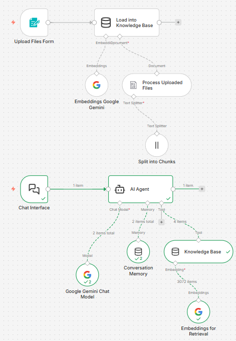

# Taller Automatización de Atención al Cliente 24/7
Tech Stack: Gemini y n8n

En este taller vamos a implementar un chatbot para responder preguntas sobre tu empresa utilizando RAG en Gemini y con el mínimo código necesario en n8n para un taller sin mucha carga técnica.

## Configuración Inicial
1. Reclama tu 5$ de crédito gratuito en [Google Cloud](https://trygcp.dev/claim/deveco-gdg-f8282f82e99)
2. Genera una API Key en [Google AI Studio](https://aistudio.google.com/)
3. Empieza un free trial en [n8n](https://n8n.io/)
4. Descarga estos documentos o usa los tuyos propios
   1. [Reglas del Golf](https://share.google/ACSvD0s1CGPaLYdNo)
   2. [Resultados Financieros de Inditex 2025](https://www.inditex.com/itxcomweb/api/media/95537a57-b33e-4fcb-8822-a200d9da68c1/INDITEXResultadosEjercicio2025.pdf)
   3. [Ejemplo ficticio - L'Heretat de Menorca](https://drive.google.com/file/d/1YW4krJAdQE7mvJFqRDVxAf3C-aWRpVpr/view?usp=sharing)
   4. Tus propios documentos
  
## Primeros pasos en n8n
### Creación de la Base de Conocimiento
1. Al rellenar un formulario
2. Simple Vector Store
   1. Modo "Insert Documents"
3. Embeddings Google Gemini
   1. Gemini Embedding 001    
5. Default Data Loader
   1. Tipo: "Binary"
   2. Modo: "All Input Data"
   3. Formato de la documentación: "Automatic"
   4. Separación de Texto: "Custom"
   5. Metadata: "filename: {{ $json.filename }}"
6. Recursive Character Text Splitter
   1. Chunk Size: 1000
   2. Chunk Overlap: 200

### Implementación del Chatbot
1. Al recibir un mensaje del chat
   1. Hazlo público con un mensaje inicial
2. AI Agent - Añade Option -> System Message
   ```
   Eres un asistente servicial. Responde a las preguntas utilizando ÚNICAMENTE la información de la herramienta de base de conocimientos. Si la respuesta no se encuentra en la base de conocimientos, di: "No tengo esa información en mi base de conocimientos". No utilices conocimientos externos ni hagas suposiciones.
   ```
   1. Google Gemini Chat Model
   2. Memoria de la Conversación - Simple Memory
   3. Base de Conocimiento - Simple Vector Store
      a. Modo: "Retrieve Documents (As Tool for AI Agent)"
   4. Embeddings for Retrieval


### Agent Flow


### Extra: integraciones externas
#### Web
Añade esto en tu web:

```
<link href="https://cdn.jsdelivr.net/npm/@n8n/chat/dist/style.css" rel="stylesheet" />
<script type="module">
   import { createChat } from 'https://cdn.jsdelivr.net/npm/@n8n/chat/dist/chat.bundle.es.js';

   createChat({
      webhookUrl: 'MY_WEB_HOOK_URL'
   });
</script>
```

#### Telegram
